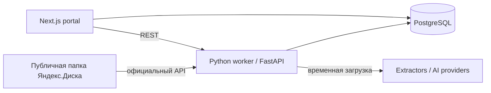

# Электротехника 2026/27

Веб-база знаний, синхронизирующая публичную папку Яндекс.Диска с каталогом учебных материалов. Большие оригиналы остаются на Диске; PostgreSQL хранит метаданные, извлечённый текст и результаты обработки.

## Архитектура



`apps/web` — интерфейс Next.js App Router. `services/worker` — FastAPI API и CLI синхронизации. SQLAlchemy используется в Python, чтобы вся обработка и модель данных находились рядом. Синхронизация использует API `resources/public`, не HTML-страницу.

## Запуск

```bash
cp .env.example .env
docker compose up --build
```

Откройте http://localhost:3000. Для ручной синхронизации:

```bash
docker compose exec worker python -m worker.sync
docker compose exec worker python -m worker.sync --full
docker compose exec worker python -m worker.process
docker compose exec worker python -m worker.transcribe
```

## Pipeline

Синхронизатор создаёт курс, обходит дерево публичного ресурса, нормализует пути и сравнивает устойчивый fingerprint (`path`, размер, дата изменения). Новые и изменённые файлы ставятся в `queued`, удалённые отмечаются как `removed`; неизменённые не обрабатываются повторно. Неподдерживаемые расширения получают `unsupported` без остановки запуска.

`worker.process` временно скачивает поставленные в очередь текстовые документы, извлекает page- или slide-aware chunks для PDF/DOCX/PPTX/XLSX/TXT/Markdown, сохраняет только результат и отмечает исходник как готовый. Затем provider создаёт валидируемый структурированный конспект. По умолчанию это детерминированный offline-provider, поэтому отсутствие API-ключа не останавливает ingestion; граница `LLMProvider` оставляет возможность подключить OpenAI. Видео и аудио остаются в очереди для отдельного этапа с ffmpeg/STT-provider.

## Разработка и тесты

```bash
cd services/worker && pip install -e '.[dev]' && pytest
cd apps/web && npm install && npm run dev
```

Миграции на старте выполняются через `Base.metadata.create_all`; перед production заменим это на Alembic, когда схема стабилизируется.
